# RetroGame Hub - Infraestructura AWS

[](https://github.com/retrogamecloud/infrastructure/actions/workflows/validate-and-scan.yml)
[](https://www.terraform.io/)
[](https://aws.amazon.com/)
[](https://opensource.org/licenses/MIT)

Infraestructura como código para desplegar RetroGame Hub en AWS usando Terraform y Kubernetes. Automatiza la creación de VPC, clúster EKS, base de datos, DNS, secretos, monitoreo y más.

**README general:** [Ir al README Principal](https://github.com/retrogamecloud/.github/blob/main/profile/README.md)  
**Documentación:** [Acceder a la Wiki](https://retrogamecloud.mintlify.app/)

---

## Tabla de Contenidos

- [Arquitectura](#arquitectura)
- [Prerrequisitos](#prerrequisitos)
- [Configuración Inicial](#configuración-inicial)
- [Bootstrap de Terraform State](#bootstrap-de-terraform-state)
- [Despliegue del Cluster EKS](#despliegue-del-cluster-eks)
- [Configuración de ArgoCD](#configuración-de-argocd)
- [Estructura de Directorios](#estructura-de-directorios)
- [Variables Terraform](#variables-terraform)
- [Verificación](#verificación)
- [Monitoreo](#monitoreo)
- [Costos AWS](#costos-aws)
- [Troubleshooting](#troubleshooting)
- [Destrucción de Recursos](#destrucción-de-recursos)
- [Servicios de AWS Utilizados](#servicios-de-aws-utilizados)
- [Pipeline CI/CD](#pipeline-cicd)
- [Referencias](#referencias)

---

## Arquitectura

```mermaid
graph TB
    subgraph "AWS Cloud"
        subgraph "Route 53"
            R53[Route 53<br/>DNS Management]
        end
        
        subgraph "VPC 10.0.0.0/16"
            subgraph "Public Subnets"
                PUB1[10.0.1.0/24<br/>AZ-A]
                PUB2[10.0.2.0/24<br/>AZ-B]
                PUB3[10.0.3.0/24<br/>AZ-C]
                IGW[Internet Gateway]
                NAT1[NAT Gateway 1]
                NAT2[NAT Gateway 2]
                NAT3[NAT Gateway 3]
            end
            
            subgraph "Private Subnets"
                PRIV1[10.0.101.0/24<br/>AZ-A]
                PRIV2[10.0.102.0/24<br/>AZ-B]
                PRIV3[10.0.103.0/24<br/>AZ-C]
            end
            
            subgraph "EKS Cluster"
                EKS[EKS Control Plane<br/>Kubernetes 1.31]
                
                subgraph "Node Group"
                    NODE1[EC2 t3.medium]
                    NODE2[EC2 t3.medium]
                end
                
                subgraph "Add-ons"
                    ALB[AWS Load Balancer<br/>Controller]
                    EBS[EBS CSI Driver]
                    ARGOCD[ArgoCD<br/>GitOps]
                end
                
                subgraph "Applications"
                    FRONTEND[Frontend<br/>Nginx]
                    BACKEND[Backend APIs<br/>Node.js]
                    CDN[CDN Static<br/>Nginx]
                    KONG[Kong Gateway<br/>API Gateway]
                end
            end
            
            subgraph "RDS Subnet Group"
                RDS[RDS PostgreSQL<br/>db.t3.micro]
            end
        end
        
        subgraph "AWS Secrets Manager"
            SEC1[GitHub Token]
            SEC2[DB Password]
            SEC3[JWT Secret]
            SEC4[Slack Token]
        end
        
        subgraph "IAM"
            ROLE1[EKS Cluster Role]
            ROLE2[Node Group Role]
            ROLE3[ALB Controller Role]
            ROLE4[EBS CSI Role]
        end
        
        subgraph "S3"
            S3B[Terraform State<br/>retrogamecloud-terraform-state]
        end
        
        subgraph "DynamoDB"
            DDB[State Lock Table<br/>terraform-state-lock]
        end
        
        subgraph "Route 53 (Bootstrap)"
            R53HZ[Hosted Zone<br/>retrogamehub.games<br/>Permanent Nameservers]
        end
        
        subgraph "Elastic Load Balancing"
            ALB2[Application Load Balancer<br/>Ingress Controller]
        end
    end
    
    subgraph "External Services"
        GH[GitHub<br/>Source Code]
        GHCR[GitHub Container Registry<br/>Docker Images]
    end
    
    subgraph "Users"
        USER[End Users]
    end
    
    USER -->|HTTPS| R53
    R53 -->|retrogamehub.games| ALB2
    R53HZ -.->|DNS Records| R53
    ALB2 --> FRONTEND
    ALB2 --> CDN
    FRONTEND --> KONG
    KONG --> BACKEND
    BACKEND --> RDS
    
    IGW --> PUB1
    IGW --> PUB2
    IGW --> PUB3
    
    PUB1 --> NAT1
    PUB2 --> NAT2
    PUB3 --> NAT3
    
    NAT1 --> PRIV1
    NAT2 --> PRIV2
    NAT3 --> PRIV3
    
    PRIV1 --> NODE1
    PRIV2 --> NODE2
    
    EKS --> NODE1
    EKS --> NODE2
    
    NODE1 --> ALB
    NODE1 --> EBS
    NODE1 --> ARGOCD
    
    ARGOCD -->|Git Sync| GH
    NODE1 -->|Pull Images| GHCR
    
    BACKEND -->|Read Secrets| SEC2
    BACKEND -->|Read Secrets| SEC3
    ARGOCD -->|Read Secrets| SEC1
    
    EKS -->|Assume| ROLE1
    NODE1 -->|Assume| ROLE2
    ALB -->|Assume| ROLE3
    EBS -->|Assume| ROLE4
    
    style EKS fill:#FF9900
    style RDS fill:#3B48CC
    style S3B fill:#569A31
    style DDB fill:#3B48CC
    style R53 fill:#8C4FFF
    style ALB2 fill:#FF9900
    style ARGOCD fill:#EF7B4D
```



## Prerrequisitos

### Software Requerido

```bash
# AWS CLI v2
curl "https://awscli.amazonaws.com/awscli-exe-linux-x86_64.zip" -o "awscliv2.zip"
unzip awscliv2.zip
sudo ./aws/install

# Terraform >= 1.9
wget https://releases.hashicorp.com/terraform/1.9.0/terraform_1.9.0_linux_amd64.zip
unzip terraform_1.9.0_linux_amd64.zip
sudo mv terraform /usr/local/bin/

# kubectl
curl -LO "https://dl.k8s.io/release/$(curl -L -s https://dl.k8s.io/release/stable.txt)/bin/linux/amd64/kubectl"
chmod +x kubectl
sudo mv kubectl /usr/local/bin/

# Helm
curl https://raw.githubusercontent.com/helm/helm/main/scripts/get-helm-3 | bash

# jq (para procesamiento JSON)
sudo apt-get install jq -y
```

### Cuenta AWS

1. **Cuenta AWS activa** con permisos de administrador
2. **Credenciales configuradas**:
```bash
aws configure
# AWS Access Key ID: [Tu Access Key]
# AWS Secret Access Key: [Tu Secret Key]
# Default region name: eu-west-1
# Default output format: json
```

3. **Verificar credenciales**:
```bash
aws sts get-caller-identity
```

### GitHub

1. **Personal Access Token** con permisos:
   - `repo` (acceso completo a repositorios)
   - `read:packages` (leer paquetes de GHCR)

2. **Repositorios**:
   - `retrogamecloud/infrastructure` (este repo)
   - `retrogamecloud/kubernetes` (manifiestos K8s)

## Configuración Inicial

### 1. Clonar Repositorios

```bash
# Crear directorio de trabajo
mkdir -p ~/retrogame && cd ~/retrogame

# Clonar repositorio de infraestructura
git clone https://github.com/retrogamecloud/infrastructure.git
cd infrastructure

# Clonar repositorio de kubernetes (opcional, ArgoCD lo clonará)
cd ~/retrogame
git clone https://github.com/retrogamecloud/kubernetes.git
```

### 2. Configurar Variables

```bash
cd ~/retrogame/infrastructure/terraform/eks

# Crear archivo de variables (copia del ejemplo)
cp terraform.tfvars.example terraform.tfvars

# Editar variables
nano terraform.tfvars
```

**Variables requeridas en `terraform.tfvars`:**

```hcl
# AWS Region
aws_region = "eu-west-1"

# Cluster Configuration
cluster_name    = "retrogame"
cluster_version = "1.31"

# Node Group Configuration
node_desired_size = 2
node_min_size     = 2
node_max_size     = 3
node_instance_types = ["t3.medium"]

# Database Configuration
db_name              = "retrogame"
db_username          = "retrogameadmin"
db_instance_class    = "db.t3.micro"
db_allocated_storage = 20

# Domain Configuration
domain_name = "retrogamehub.games"
hosted_zone_id = "Z10264772Z8A8KXWT1EXH"  # IMPORTANTE: Usar el output del bootstrap

# GitHub Configuration
github_token = "ghp_xxxxxxxxxxxxxxxxxxxx"  # Tu GitHub PAT
github_org   = "retrogamecloud"

# Secrets (generados automáticamente si no se proporcionan)
# db_password = ""  # Se genera automático si está vacío
# jwt_secret = ""   # Se genera automático si está vacío
```

**IMPORTANTE:** El `hosted_zone_id` DEBE ser el que obtuviste del output del bootstrap:

```bash
# Obtener Hosted Zone ID del bootstrap
cd ~/retrogame/infrastructure/terraform/bootstrap
terraform output -raw hosted_zone_id

# Copiar este ID a terraform/eks/terraform.tfvars
```

### 3. Variables Sensibles

**Opción 1: Variables de entorno (recomendado)**

```bash
export TF_VAR_github_token="ghp_xxxxxxxxxxxxxxxxxxxx"
export TF_VAR_db_password="$(openssl rand -base64 32)"
export TF_VAR_jwt_secret="$(openssl rand -base64 64)"
```

**Opción 2: Archivo `secrets.tfvars`** (NO commitear)

```bash
cat > secrets.tfvars <<EOF
github_token = "ghp_xxxxxxxxxxxxxxxxxxxx"
db_password  = "$(openssl rand -base64 32)"
jwt_secret   = "$(openssl rand -base64 64)"
EOF

# Agregar a .gitignore
echo "secrets.tfvars" >> .gitignore
```

---

## Estructura de Directorios

```
infrastructure/
├── .github/
│   ├── dependabot.yml             # Configuración de Dependabot
│   └── workflows/
│       └── validate-and-scan.yml # Validación de Terraform + Trivy
│
├── terraform/
│   ├── bootstrap/               # Configuración inicial (S3, DynamoDB, Route53)
│   │   ├── main.tf             # Bootstrap principal
│   │   ├── s3-tfstate.tf       # Bucket S3 para remote state
│   │   ├── dynamodb.tf         # DynamoDB para state locking
│   │   ├── route53.tf          # Route 53 Hosted Zone
│   │   ├── iam.tf              # Roles y políticas
│   │   ├── provider.tf
│   │   ├── variables.tf
│   │   ├── outputs.tf
│   │   ├── terraform.tfvars.example
│   │   ├── README.md
│   │   └── .gitignore
│   │
│   ├── eks/
│   │   ├── main.tf             # Definición del cluster EKS
│   │   ├── variables.tf
│   │   ├── outputs.tf
│   │   ├── karpenter.tf        # Auto-scaling con Karpenter
│   │   ├── iam-roles.tf
│   │   ├── security-groups.tf
│   │   ├── terraform.tfvars.example
│   │   └── .gitignore
│   │
│   ├── github/                 # Configuración de GitHub (secrets, tokens)
│   │   ├── main.tf
│   │   ├── modules/
│   │   ├── README.md
│   │   └── .gitignore
│   │
│   ├── main.tf                 # Orquestación principal
│   ├── variables.tf            # Variables globales
│   ├── outputs.tf
│   ├── terraform.tfvars.example # Valores específicos (COPIAR)
│   ├── backend.tf              # Remote state (S3)
│   └── .gitignore
│
├── cdn/                        # Configuración de CDN (nginx)
├── monitoring/                 # Configuración de monitoreo
├── argocd/                     # Configuración de GitOps (Argo CD)
├── tests/
│   ├── terraform_test.sh
│   └── README.md
└── README.md (este archivo)
```

---

## Variables Terraform

### Stack Tecnológico

| Componente | Versión | Descripción |
|---|---|---|
| **Terraform** | ~1.9+ | Infrastructure as Code |
| **AWS** | Latest | Cloud provider |
| **EKS** | 1.31 | Kubernetes managed |
| **VPC** | AWS VPC | Networking (10.0.0.0/16) |
| **RDS** | PostgreSQL 15 | Database |
| **ALB** | Application LB | Load balancer |
| **Route53** | AWS DNS | Domain management |
| **ACM** | AWS Certificates | SSL/TLS |
| **Secrets Manager** | AWS | Credentials |
| **Prometheus** | 2.45+ | Metrics collection |
| **Grafana** | 10.0+ | Dashboards |
| **ArgoCD** | 2.10+ | GitOps |

### Configuración Principal (terraform.tfvars)

```hcl
# AWS Region
aws_region = "eu-west-1"
environment = "production"

# Cluster EKS
cluster_name = "retrogame"
cluster_version = "1.31"
kubernetes_network_cidr = "10.100.0.0/16"

# VPC
vpc_cidr = "10.0.0.0/16"
availability_zones = ["eu-west-1a", "eu-west-1b", "eu-west-1c"]
private_subnet_cidrs = ["10.0.101.0/24", "10.0.102.0/24", "10.0.103.0/24"]
public_subnet_cidrs = ["10.0.1.0/24", "10.0.2.0/24", "10.0.3.0/24"]

# Nodos EKS
desired_capacity = 2
min_size = 2
max_size = 3
instance_types = ["t3.medium", "t3.large"]

# RDS PostgreSQL
db_instance_class = "db.t3.micro"
allocated_storage = 20
engine_version = "15.3"

# Route53
domain_name = "retrogamehub.games"

# Monitoreo
enable_prometheus = true
enable_grafana = true
grafana_admin_password = "SecurePassword123!"

# Costos
enable_cost_monitoring = true
```

### Variables con Valores por Defecto

```hcl
variable "aws_region" {
  description = "AWS region (default: eu-west-1)"
  type = string
  default = "eu-west-1"
}

variable "cluster_version" {
  description = "Kubernetes version"
  type = string
  default = "1.31"
}

variable "cluster_name" {
  description = "Nombre del cluster EKS"
  type = string
  default = "retrogame"
}

variable "vpc_cidr" {
  description = "CIDR de la VPC"
  type = string
  default = "10.0.0.0/16"
}

variable "db_instance_class" {
  description = "Clase de instancia RDS"
  type = string
  default = "db.t3.micro"
}
```

---

## Bootstrap de Terraform State

El bootstrap configura los recursos necesarios para el backend remoto de Terraform y la infraestructura base de Route 53.

### ¿Qué hace el bootstrap?

El módulo de bootstrap se encarga de:

1. **Backend Remoto de Terraform:**
   - Bucket S3 para almacenar el estado de Terraform
   - Tabla DynamoDB para bloqueo de estado (evita modificaciones concurrentes)
   - Cifrado y versionado habilitados para seguridad

2. **Route 53 Hosted Zone (IMPORTANTE):**
   - Crea la Hosted Zone para tu dominio
   - **Preserva los nameservers entre destrucciones**: Los nameservers de Route 53 NO cambian cuando destruyes y recreas la infraestructura
   - **Sin necesidad de actualizar tu registrador de dominio**: Una vez configurados los nameservers en tu registrador (ej: GoDaddy, Namecheap), nunca más tendrás que cambiarlos

**¿Por qué esto es importante?**

Sin el bootstrap de Route 53, cada vez que destruyas y recrees la infraestructura con Terraform, AWS asignaría **nuevos nameservers diferentes**, obligándote a:
1. Ir a tu registrador de dominio
2. Actualizar los nameservers
3. Esperar 24-48h para propagación DNS

Con el bootstrap, la Hosted Zone se crea UNA VEZ y se mantiene permanente, permitiendo ciclos infinitos de destroy/apply sin tocar la configuración DNS.

### 1. Configurar Variables de Bootstrap

```bash
cd ~/retrogame/infrastructure/terraform/bootstrap

# Editar variables
nano terraform.tfvars
```

**Contenido de `terraform.tfvars`:**

```hcl
# Domain Configuration
domain_name = "retrogamehub.games"  # Tu dominio

# AWS Region
aws_region = "eu-west-1"

# State Backend Configuration
state_bucket_name = "retrogamecloud-terraform-state"
dynamodb_table_name = "terraform-state-lock"
```

### 2. Bootstrap Automático

```bash
cd ~/retrogame/infrastructure/terraform/bootstrap

# Inicializar
terraform init

# Planificar
terraform plan

# Aplicar
terraform apply -auto-approve
```

**Recursos creados:**
- **Bucket S3**: `retrogamecloud-terraform-state`
  - Versionado habilitado
  - Cifrado AES-256
  - Bloqueo de acceso público
  
- **Tabla DynamoDB**: `terraform-state-lock`
  - Billing mode: PAY_PER_REQUEST
  - Hash key: `LockID`
  
- **Route 53 Hosted Zone**: `retrogamehub.games`
  - 4 nameservers AWS permanentes
  - Tag: `ManagedBy = bootstrap`

### 3. Configurar Nameservers en tu Registrador

**IMPORTANTE:** Este paso solo se hace UNA VEZ, al principio.

```bash
# Obtener nameservers de la Hosted Zone
terraform output -raw name_servers
```

**Salida esperada:**
```
ns-1234.awsdns-12.org
ns-5678.awsdns-34.com
ns-9012.awsdns-56.net
ns-3456.awsdns-78.co.uk
```

**Configurar en tu registrador de dominio:**

1. **GoDaddy**:
   - My Products → Domains → DNS
   - Change Nameservers → Custom
   - Pegar los 4 nameservers de AWS

2. **Namecheap**:
   - Domain List → Manage → Custom DNS
   - Pegar los 4 nameservers de AWS

3. **Google Domains**:
   - My Domains → DNS → Name servers
   - Use custom name servers
   - Pegar los 4 nameservers de AWS

**Verificar propagación DNS** (puede tardar hasta 48h):
```bash
# Verificar nameservers
dig NS retrogamehub.games +short

# Verificar con diferentes DNS públicos
dig @8.8.8.8 NS retrogamehub.games +short  # Google DNS
dig @1.1.1.1 NS retrogamehub.games +short  # Cloudflare DNS
```

### 4. Verificar Bootstrap

```bash
# Verificar bucket
aws s3 ls s3://retrogamecloud-terraform-state

# Verificar tabla DynamoDB
aws dynamodb describe-table --table-name terraform-state-lock --query 'Table.TableStatus'

# Verificar Hosted Zone
aws route53 list-hosted-zones --query 'HostedZones[?Name==`retrogamehub.games.`]'

# Obtener Hosted Zone ID (necesario para terraform.tfvars del EKS)
terraform output -raw hosted_zone_id
```

### 5. Guardar Hosted Zone ID

El ID de la Hosted Zone es **necesario** para el despliegue del cluster EKS:

```bash
# Copiar el Hosted Zone ID
HOSTED_ZONE_ID=$(cd ~/retrogame/infrastructure/terraform/bootstrap && terraform output -raw hosted_zone_id)
echo "Hosted Zone ID: $HOSTED_ZONE_ID"

# Este ID lo usarás en terraform/eks/terraform.tfvars
```

## Despliegue del Cluster EKS

### 1. Inicializar Terraform

```bash
cd ~/retrogame/infrastructure/terraform/eks

# Inicializar backend remoto
terraform init
```

### 2. Planificar Despliegue

```bash
# Plan completo
terraform plan

# O con archivo de secrets
terraform plan -var-file="secrets.tfvars"

# Guardar plan
terraform plan -out=tfplan
```

### 3. Aplicar Infraestructura

```bash
# Aplicar (tarda ~15-20 minutos)
terraform apply -auto-approve

# O desde plan guardado
terraform apply tfplan
```

**Salida esperada:**
```
Apply complete! Resources: 72 added, 0 changed, 0 destroyed.

Outputs:

argocd_admin_password = <sensitive>
cluster_endpoint = "https://xxxxx.yl4.eu-west-1.eks.amazonaws.com"
cluster_name = "retrogame"
configure_kubectl = "aws eks update-kubeconfig --region eu-west-1 --name retrogame"
db_endpoint = "retrogame-db.xxxxx.eu-west-1.rds.amazonaws.com:5432"
region = "eu-west-1"
```

### 4. Configurar kubectl

```bash
# Actualizar kubeconfig
aws eks update-kubeconfig --region eu-west-1 --name retrogame

# Verificar conexión
kubectl cluster-info
kubectl get nodes
```

**Salida esperada:**
```
NAME                                         STATUS   ROLES    AGE   VERSION
ip-10-0-1-xxx.eu-west-1.compute.internal    Ready    <none>   5m    v1.31.x
ip-10-0-2-xxx.eu-west-1.compute.internal    Ready    <none>   5m    v1.31.x
```

---

## Verificación

### 1. Verificar Infraestructura

```bash
# VPC
aws ec2 describe-vpcs --filters "Name=tag:Name,Values=retrogame-vpc" \
  --query 'Vpcs[0].VpcId'

# Subnets
aws ec2 describe-subnets --filters "Name=vpc-id,Values=$(terraform output -raw vpc_id)" \
  --query 'Subnets[*].[SubnetId,CidrBlock,AvailabilityZone]' --output table

# Security Groups
aws ec2 describe-security-groups --filters "Name=vpc-id,Values=$(terraform output -raw vpc_id)" \
  --query 'SecurityGroups[*].[GroupId,GroupName]' --output table

# RDS
aws rds describe-db-instances --db-instance-identifier retrogame-db \
  --query 'DBInstances[0].[DBInstanceStatus,Endpoint.Address]' --output table

# Secrets
aws secretsmanager list-secrets --query 'SecretList[?contains(Name, `retrogame`)].Name'
```

### 2. Verificar Kubernetes

```bash
# Namespaces
kubectl get namespaces

# Todos los recursos en retrogame
kubectl get all -n retrogame

# Ingress
kubectl get ingress -n retrogame

# Servicios
kubectl get svc -n retrogame
```

### 3. Verificar Load Balancer

```bash
# Obtener DNS del ALB
kubectl get ingress -n retrogame -o jsonpath='{.items[0].status.loadBalancer.ingress[0].hostname}'

# Testear endpoint
INGRESS_DNS=$(kubectl get ingress frontend-ingress -n retrogame -o jsonpath='{.status.loadBalancer.ingress[0].hostname}')
curl -H "Host: retrogamehub.games" http://$INGRESS_DNS/health
```

### 4. Verificar DNS (si está configurado)

```bash
# Verificar registro Route53
aws route53 list-resource-record-sets \
  --hosted-zone-id Z10264772Z8A8KXWT1EXH \
  --query "ResourceRecordSets[?Name == 'retrogamehub.games.']"

# Testear resolución DNS
nslookup retrogamehub.games

# Testear aplicación
curl https://retrogamehub.games/health
```

## Monitoreo

### Prometheus

```bash
# Acceder a Prometheus
kubectl port-forward -n prometheus svc/prometheus 9090:9090
# http://localhost:9090
```

**Métricas principales:**
- `node_cpu_seconds_total` - CPU del nodo
- `node_memory_MemAvailable_bytes` - Memoria disponible
- `kubelet_running_pods` - Pods ejecutándose
- `http_request_duration_seconds` - Latencia HTTP

### Grafana

```bash
# Acceder a Grafana
kubectl port-forward -n monitoring svc/grafana 3000:80
# http://localhost:3000
# Usuario: admin
# Contraseña: (ver en Secrets Manager)
```

**Dashboards:**
- Kubernetes Cluster Monitoring
- Node Exporter Full
- PostgreSQL Database
- Kong API Gateway

### AlertManager

```bash
# Alertas configuradas:
# - CPU > 80%
# - Memoria > 85%
# - Pods pendientes > 5
# - Pod CrashLoopBackOff
```

---

## Costos AWS

### Desglose por Servicio

| Servicio | Configuración | Costo/mes (USD) |
|----------|---------------|-----------------|
| **EKS Control Plane** | 1 cluster | $72 |
| **EC2 Instances** | 2x t3.medium | ~$60 |
| **NAT Gateways** | 3x NAT | ~$100 |
| **RDS PostgreSQL** | db.t3.micro | ~$15 |
| **EBS Volumes** | ~50GB | ~$5 |
| **Application LB** | 1 ALB | ~$20 |
| **Route 53** | 1 hosted zone | $0.50 |
| **Secrets Manager** | 6 secrets | $2.40 |
| **S3 + DynamoDB** | State backend | <$1 |
| **Total** | | **~$275/mes** |

**Nota:** Costos de transferencia de datos no incluidos. Para reducir costos en desarrollo:
- Reducir NAT Gateways a 1
- Usar instancias spot para nodes (60% descuento)
- Pausar RDS cuando no se use
- Usar db.t3.micro en lugar de pequeño

## Troubleshooting

### Error: "insufficient capacity"

Los nodos no pueden lanzarse en la AZ seleccionada.

**Solución:**
```hcl
# En eks/main.tf, cambiar availability_zones
availability_zones = ["eu-west-1a", "eu-west-1b", "eu-west-1c"]
```

### Error: "Security group has dependent object"

El ALB creó security groups que no pueden eliminarse.

**Solución:**
```bash
# Eliminar del state
terraform state rm aws_security_group.alb

# Eliminar manualmente
aws ec2 describe-security-groups --filters "Name=tag:kubernetes.io/cluster/retrogame,Values=owned" \
  --query 'SecurityGroups[*].GroupId' --output text | \
  xargs -I {} aws ec2 delete-security-group --group-id {}

# Reintentar destroy
terraform destroy -auto-approve
```

### ArgoCD no sincroniza

**Solución:**
```bash
# Verificar token de GitHub
kubectl get secret -n argocd argocd-repo-creds-github-token -o jsonpath='{.data.password}' | base64 -d

# Forzar refresh
kubectl patch app retrogame-apps -n argocd --type merge \
  -p '{"metadata":{"annotations":{"argocd.argoproj.io/refresh":"hard"}}}'
```

### Pods en CrashLoopBackOff

**Solución:**
```bash
# Ver logs
kubectl logs -n retrogame <pod-name> --previous

# Verificar secretos
kubectl get secrets -n retrogame

# Verificar conectividad a RDS
kubectl run -it --rm debug --image=postgres:15 --restart=Never -- \
  psql -h <RDS_ENDPOINT> -U retrogameadmin -d retrogame
```

### Error: VPC Limit Exceeded

Los nodos no pueden lanzarse por límite de VPC.

**Solución:**
```bash
# Ver límites
aws service-quotas list-service-quotas \
  --service-code vpc

# Solicitar aumento
aws service-quotas request-service-quota-increase \
  --service-code vpc \
  --quota-code VPC_PER_REGION \
  --desired-value 10
```

### Error: IAM Permission Denied

Usuario sin permisos en AWS.

**Solución:**
```bash
# Verificar usuario actual
aws iam get-user
aws iam list-attached-user-policies --user-name <user>

# Política requerida: AdministratorAccess (o más específica)
```

### EKS Nodes No Aparecen

Karpenter no crea nodos automáticamente.

**Solución:**
```bash
# Ver logs de Karpenter
kubectl logs -n karpenter -l app.kubernetes.io/name=karpenter

# Ver eventos
kubectl describe node

# Verificar recursos
kubectl top nodes

# Reiniciar Karpenter
kubectl rollout restart -n karpenter deployment/karpenter
```

### RDS Connection Error

No conecta a PostgreSQL.

**Solución:**
```bash
# Verificar security group
aws ec2 describe-security-groups \
  --filters "Name=group-name,Values=rds-sg"

# Añadir ingress para EKS
aws ec2 authorize-security-group-ingress \
  --group-id sg-xxx \
  --protocol tcp \
  --port 5432 \
  --source-security-group-id sg-yyy
```

## Destrucción de Recursos

### 1. Eliminar Aplicaciones (opcional)

```bash
# Eliminar aplicación de ArgoCD
kubectl delete application retrogame-apps -n argocd
```

### 2. Destruir Infraestructura con Terraform

```bash
cd ~/retrogame/infrastructure/terraform/eks

# Plan de destrucción
terraform plan -destroy

# Destruir (tarda ~10-15 minutos)
terraform destroy -auto-approve
```

**Nota:** Si hay errores con Security Groups del ALB:
```bash
# Eliminar del state
terraform state rm aws_security_group.alb

# Reintentar destroy
terraform destroy -auto-approve
```

### 3. Limpieza Manual (si es necesario)

```bash
# Verificar Load Balancers huérfanos
aws elbv2 describe-load-balancers --region eu-west-1 \
  --query 'LoadBalancers[?contains(LoadBalancerName, `retrogame`)].LoadBalancerArn' \
  --output text | xargs -I {} aws elbv2 delete-load-balancer --load-balancer-arn {}

# Verificar Security Groups huérfanos
aws ec2 describe-security-groups --region eu-west-1 \
  --filters "Name=tag:kubernetes.io/cluster/retrogame,Values=owned" \
  --query 'SecurityGroups[*].GroupId' --output text | \
  xargs -I {} aws ec2 delete-security-group --group-id {}
```

### 4. Destruir Backend (opcional)

```bash
cd ~/retrogame/infrastructure/terraform/bootstrap

# Solo si NO vas a volver a desplegar
terraform destroy -auto-approve
```

**⚠️ ADVERTENCIA:** Destruir el bootstrap eliminará:
- El bucket S3 con el estado de Terraform (si está vacío)
- La tabla DynamoDB de state locking
- **La Hosted Zone de Route 53** (perderás los nameservers permanentes)

**NO destruyas el bootstrap** si planeas:
- Volver a desplegar la infraestructura en el futuro
- Mantener los mismos nameservers en tu registrador de dominio
- Evitar tener que reconfigurar DNS cada vez

**Solo destruye el bootstrap si:**
- Vas a migrar a otra cuenta de AWS completamente
- Ya no usarás este dominio para el proyecto
- Estás haciendo limpieza definitiva del proyecto

## Servicios de AWS Utilizados

### Compute

| Servicio | Propósito | Configuración |
|----------|-----------|---------------|
| **EKS** | Kubernetes managed control plane | v1.31, Multi-AZ |
| **EC2** | Worker nodes | 2x t3.medium (2 vCPU, 4GB RAM) |
| **Auto Scaling** | Escalado automático de nodos | Min: 2, Max: 3, Desired: 2 |

### Networking

| Servicio | Propósito | Configuración |
|----------|-----------|---------------|
| **VPC** | Red aislada | 10.0.0.0/16, 3 AZs |
| **Subnets** | Segmentación de red | 3 públicas + 3 privadas |
| **Internet Gateway** | Salida a internet (públicas) | 1 IGW |
| **NAT Gateway** | Salida a internet (privadas) | 3 NAT (1 por AZ) |
| **Route Tables** | Enrutamiento | 1 pública + 3 privadas |
| **Security Groups** | Firewall virtual | Cluster, Nodes, RDS, ALB |
| **Route 53** | DNS management | Hosted Zone + A record |
| **Elastic Load Balancer** | Distribución de tráfico | Application LB via Ingress |

### Storage

| Servicio | Propósito | Configuración |
|----------|-----------|---------------|
| **EBS** | Volúmenes persistentes | gp3, CSI Driver |
| **S3** | Terraform state storage | Versionado + cifrado |

### Database

| Servicio | Propósito | Configuración |
|----------|-----------|---------------|
| **RDS PostgreSQL** | Base de datos relacional | db.t3.micro, 20GB, Multi-AZ opcional |
| **DynamoDB** | State locking | On-demand billing |

### Security

| Servicio | Propósito | Configuración |
|----------|-----------|---------------|
| **IAM** | Gestión de permisos | 4 roles (cluster, nodes, ALB, EBS) |
| **Secrets Manager** | Gestión de secretos | 6 secrets (GitHub, DB, JWT, Slack, OAuth) |
| **KMS** | Cifrado | Cifrado de secrets y EBS |

### Monitoring (Opcional)

| Servicio | Propósito | Configuración |
|----------|-----------|---------------|
| **CloudWatch** | Logs y métricas | Container Insights |
| **Grafana** | Visualización | OAuth2 authentication |
| **Prometheus** | Métricas | Helm chart |

### GitOps

| Servicio | Propósito | Configuración |
|----------|-----------|---------------|
| **ArgoCD** | Continuous Deployment | v2.9.3, GitHub sync |

## Pipeline CI/CD

Este repositorio implementa validaciones automáticas mediante GitHub Actions para asegurar la calidad y seguridad de las configuraciones de infraestructura como código.

### Validaciones Automáticas

Cada vez que haces un push o abres un Pull Request, se ejecutan automáticamente:

✅ **Terraform Linting:** `terraform fmt` y `terraform validate` en todos los directorios  
✅ **Validación:** `terraform init` verifica configuración y plugins  
✅ **Escaneo de Vulnerabilidades:** Trivy escanea el código Terraform  
✅ **Análisis Estático:** SonarCloud detecta misconfigurations y problemas de IaC  
✅ **ArgoCD:** Validación de manifiestos GitOps  
✅ **Notificaciones:** Slack alertas para fallos críticos en validaciones  

### Workflows Disponibles

| Workflow | Trigger | Descripción |
|---|---|---|
| **validate-and-scan.yml** | Push a `main`, PR | Validación Terraform, seguridad y análisis estático |
| **dependabot.yml** | Scheduled (diario) | Mantener dependencias y providers actualizados |

**Documentación detallada:** Ver [`.github/README-WF.md`](./.github/README-WF.md) para más información sobre cada workflow, triggers, variables y secrets.

## Referencias

### Documentación Oficial

- [Terraform AWS Provider](https://registry.terraform.io/providers/hashicorp/aws/latest/docs)
- [AWS EKS Best Practices](https://aws.github.io/aws-eks-best-practices/)
- [Karpenter Documentation](https://karpenter.sh/docs/)
- [ArgoCD Documentation](https://argoproj.github.io/argo-cd/)

### Documentación del Proyecto

- **Workflows CI/CD:** [.github/README-WF.md](./.github/README-WF.md)
- **README general:** [/README.md](/../README.md)

### Repositorios Relacionados

- [Backend API](https://github.com/retrogamecloud/backend/blob/main/README.md)
- [Frontend](https://github.com/retrogamecloud/frontend/blob/main/README.md)
- [Kong Gateway](https://github.com/retrogamecloud/kong/blob/main/README.md)
- [Kubernetes Manifests](https://github.com/retrogamecloud/kubernetes/blob/main/README.md)
- [Documentación Centralizada](https://github.com/retrogamecloud/docs)

### Documentación Externa

- [Terraform Cloud Console](https://app.terraform.io/)
- [Terraform Registry](https://registry.terraform.io/)
- [AWS EKS Documentation](https://docs.aws.amazon.com/eks/)
- [Kubernetes Official Docs](https://kubernetes.io/docs/)

---

**Última actualización:** 4 de diciembre de 2025  
**Versión:** 2.0  
**Mantenedor:** RetroGameCloud DevOps Team
